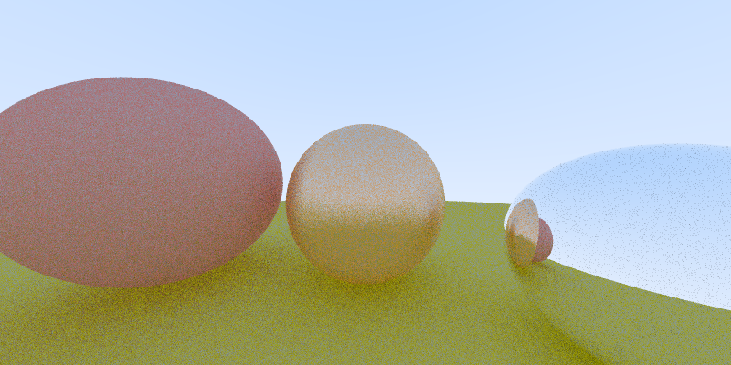

# the-raytracers: C
This is the basic C implementation of the raytracer.

This implementation processes roughly 1.2M samples per second on my i7-6700k @ 4.00 GHz.

The 800x400 image was generated at 1000 samples per pixel.

