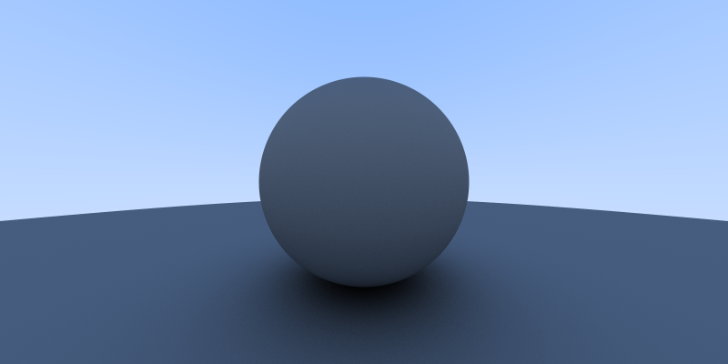

# the-raytracers: Java

This is the basic Java implementation of the raytracer.

## Compiling

This program can be compiled by typing `make` from the current directory. This
will compile all `.java` files in `src/raytracer` and put the generated `.class`
files into a new directory in this current directory called `bin/raytracer`.
Move into the bin directory with `cd bin` and then type `java raytracer.Raytracer <scenefile>`
to execute the program. The output PPM file will be placed in the `bin` directory.

## Benchmark

This implementation processes roughly 3.78M samples per second on my i7-6700k @ 4.00 GHz.

## Current State

The 800x400 image was generated at 1000 samples per pixel.

