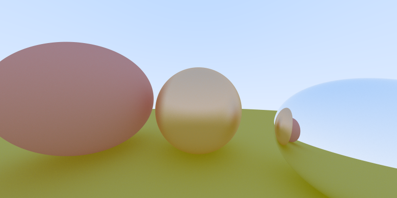

# the-raytracers: Java
This is the basic Java implementation of the raytracer.

This implementation processes roughly 3.78M samples per second on my i7-6700k @ 4.00 GHz.

The 800x400 image was generated at 1000 samples per pixel.

